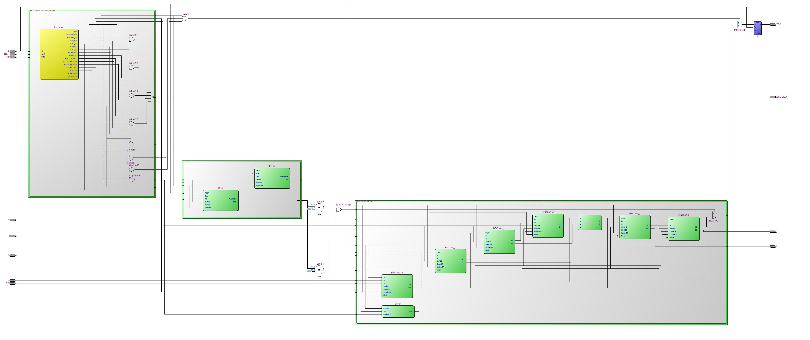

# Boundary Scan Testing - JTAG Implementation
In this assignment, a boundary scan testing methodology is implemented using the JTAG IEEE 1149.1 standard. JTAG provides a serial interface that enables intrusive and non-intrusive access to internal logic through a standardized protocol for probing and testing. It offers a systematic approach to testing not only individual integrated circuits, but also multiple blocks, within a SoC or on a PCB, connected in a chain configuration, eliminating the need for individual block testing.

The basic blocks such as the Tap Controller, Bypass/Instruction register and the Boundary Scan Cells needed to be implemented and their functionality validated through testbenches. The blocks were used to create the 2-bit Instruction register supporting the basic JTAG instructions (BYPASS, SAMPLE/PRELOAD, EXTEST). Together with the Tap Controller and Decoder Logic, they were integrated into the basic Circuit Under Test from the previous assignments by constructing the Boundary Scan Chain using the BSC cells.

# JTAG Testing Flow
The JTAG IEEE 1149.1 test flow begins with the tap controller, which manages the state transitions based on the TMS and TCK signaling. Since the amount of testing pins needs to be minimized, the Tap Controller uses an FSM for the state transition logic. The state can be set by inputting the appropriate sequence of the TMS signal pin. Depending on the state being related to IR or DR, the internal mux will link the TDI and TDO pins to the instruction or data logic and prepare the internal blocks. 

More precisely, IR states will link the TDI and TDO pins to the instruction logic so that JTAG instructions can be shifted into the instruction register to configure the testing method. Meanwhile, DR states link the pins to test-related blocks—such as scan chains, BIST blocks, etc. — for Datapath testing. This enables test vectors to be shifted in (intrusive testing) and the responses from the circuits under test to be shifted out, allowing both intrusive and non-intrusive testing.

More detailed info, waveforms and testbenches are under the jtag.pdf

Assignment material provided as part of the Circuit Reliability and Testing Course (Prof. Vasileios Tenentes)

# High level block

# Synthesized Verilog

